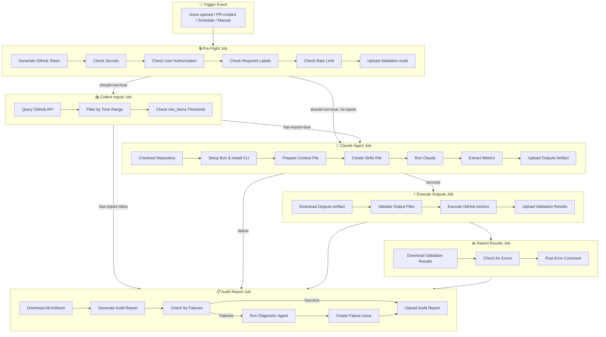
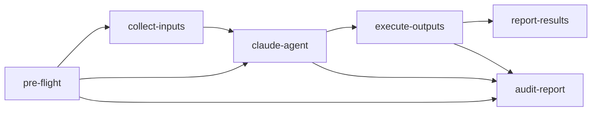
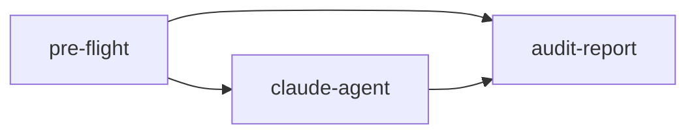
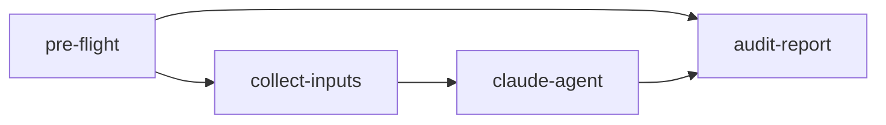
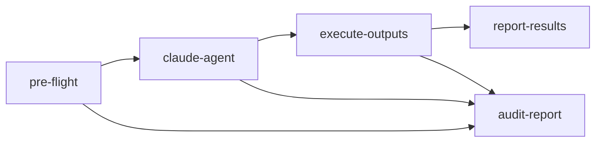
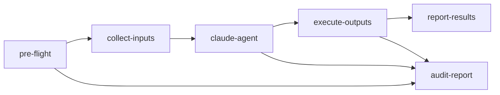

When a trigger fires, gh-claude agents run through a multi-job workflow in GitHub Actions. This page provides a visual overview of how agents execute and what happens at each stage.

## Complete Execution Flow

## Job Dependencies

The workflow uses a dependency chain to ensure proper execution order:

| Job | Depends On | Condition |
|-----|------------|-----------|
| `pre-flight` | — | Always runs |
| `collect-inputs` | `pre-flight` | Only if `inputs` configured and pre-flight passes |
| `claude-agent` | `pre-flight`, `collect-inputs` | Pre-flight passes AND inputs threshold met |
| `execute-outputs` | `claude-agent` | Only if `outputs` configured and agent succeeds |
| `report-results` | `execute-outputs` | Only if `outputs` configured |
| `audit-report` | All jobs | Always runs (tracks success/failure) |

## Job Details

### Pre-Flight Job

The pre-flight job runs security and validation checks before allowing agent execution.

**Steps:**
1. **Generate GitHub Token** — Creates a GitHub App token (if configured) or uses default `GITHUB_TOKEN`
2. **Check Secrets** — Verifies `ANTHROPIC_API_KEY` or `CLAUDE_CODE_OAUTH_TOKEN` exists
3. **Check User Authorization** — Validates the triggering user has permission (admin/write/org member/allowed list)
4. **Check Required Labels** — Verifies trigger labels are present (if configured)
5. **Check Rate Limit** — Ensures minimum interval between runs (default: 5 minutes)

**Outputs:**
- `should-run` — `true` if all checks pass
- `rate-limited` — `true` if skipped due to rate limiting

### Collect Inputs Job

*Only runs if `inputs` is configured in the agent definition.*

Collects repository data for scheduled or batch-processing agents.

**Capabilities:**
- Query issues, PRs, discussions, commits, releases, workflow runs, stars, forks
- Filter by time range (`last-run`, `1h`, `24h`, `7d`)
- Skip execution if `min_items` threshold not met

**Outputs:**
- `has-inputs` — `true` if enough data collected
- `inputs-data` — Formatted markdown of collected data

### Claude Agent Job

The main execution job where Claude analyzes and responds.

**Steps:**
1. **Checkout Repository** — Clone the repository for Claude to read
2. **Setup Bun & Install CLI** — Prepare the Claude Code CLI
3. **Prepare Context File** — Combine event data, collected inputs, issue/PR details
4. **Create Skills File** — Generate `.claude/CLAUDE.md` with output instructions
5. **Run Claude** — Execute Claude with the prepared context
6. **Extract Metrics** — Log cost, turns, duration, session ID
7. **Upload Outputs Artifact** — Save output files for the next job

**Tool Permissions:**
- With outputs: `Write(/tmp/outputs/*),Read,Glob,Grep`
- Without outputs: `Read,Glob,Grep`

### Execute Outputs Job

*Only runs if `outputs` is configured in the agent definition.*

Validates and executes agent outputs using a matrix strategy (parallel execution).

**Steps:**
1. **Download Outputs Artifact** — Retrieve files from claude-agent job
2. **Validate Output Files** — Check against JSON schemas
3. **Execute GitHub Actions** — Run `gh` CLI commands
4. **Upload Validation Results** — Save results for reporting

**Matrix Strategy:**
Each output type (add-comment, add-label, create-pr, etc.) runs as a separate parallel job instance.

### Report Results Job

*Only runs if `outputs` is configured.*

Collects validation errors and reports them.

**Steps:**
1. **Download Validation Results** — Merge results from all matrix instances
2. **Check for Errors** — Identify failed validations
3. **Post Error Comment** — Add comment to issue/PR with error details

### Audit Report Job

Always runs to track execution metrics and handle failures.

**Steps:**
1. **Download All Artifacts** — Collect validation, metrics, and output data
2. **Generate Audit Report** — Create markdown report with job results and metrics
3. **Check for Failures** — Determine if any job failed
4. **Run Diagnostic Agent** *(on failure)* — Claude analyzes failure in safe read-only mode
5. **Create Failure Issue** *(on failure)* — Open issue with diagnosis and remediation steps
6. **Upload Audit Report** — Save report as artifact

## Conditional Job Execution

Different agent configurations result in different workflow structures:

### Minimal Agent (no inputs, no outputs)

### Agent with Inputs Only

### Agent with Outputs Only

### Full Agent (inputs + outputs)

## Failure Handling

When failures occur, the audit-report job:

1. **Detects the failure** by checking job results
2. **Runs a diagnostic agent** in safe read-only mode
3. **Creates a GitHub issue** with:
   - Failure summary
   - Root cause analysis
   - Specific remediation steps
   - Link to workflow run
   - Full audit report

This ensures failures are visible and actionable, not silently lost in logs.

## Next Steps

- Learn about [Pre-Flight Checks](../reference/security-model/) in the security model
- Configure [Inputs](../inputs/) for data collection
- Set up [Outputs](../outputs/) for agent actions
- Review [Troubleshooting](./troubleshooting/) for common issues
