# Issue Lifecycle in Repo-Agents

This document visualizes how issues are created and managed in this repository through a combination of human actions and AI agents.

## Issue Lifecycle Flow

```mermaid
flowchart TD
    %% Entry Points
    Human([👤 Human Creates Issue]):::humanNode
    AuditFail[🤖 Agent Audit Failure]:::aiNode

    %% Issue Creation
    Human --> NewIssue{{📋 New Issue Created}}:::eventNode
    AuditFail --> AIIssue{{🔧 AI Creates Issue}}:::eventNode
    AIIssue --> NewIssue

    %% Issue Analyzer Agent
    NewIssue -->|Triggers| Analyzer[🤖 Issue Analyzer Agent<br/>Checks completeness]:::agentNode

    Analyzer -->|Missing Info| NeedsInfo[🏷️ Label: needs-info]:::labelNode
    Analyzer -->|Complete| ReadyTriage[🏷️ Label: ready-for-triage]:::labelNode
    Analyzer -->|Simple & Clear| GoodFirst[🏷️ Label: good-first-issue]:::labelNode

    %% Human Intervention for Missing Info
    NeedsInfo --> HumanUpdate1([👤 Human Updates Issue]):::humanNode
    HumanUpdate1 --> NeedsFormat{Needs<br/>Formatting?}:::decisionNode

    %% Optional Formatting Path
    NeedsFormat -->|Yes| FormatLabel[🏷️ Label: needs-formatting]:::labelNode
    FormatLabel -->|Triggers| Formatter[🤖 Issue Formatter Agent<br/>Restructures content]:::agentNode
    Formatter --> FormatterReady[🏷️ Label: ready-for-triage<br/>Remove: needs-formatting]:::labelNode
    FormatterReady --> Triage

    NeedsFormat -->|No| ReadyTriage

    %% Issue Triage Agent
    ReadyTriage -->|Triggers| Triage[🤖 Issue Triage Agent<br/>Categorizes issue]:::agentNode

    Triage --> TriageLabels[🏷️ Labels Added:<br/>- Type: bug/feature/enhancement/etc<br/>- Priority: critical/high/medium/low<br/>- Area: parser/generator/cli/etc<br/>- triaged]:::labelNode
    TriageLabels --> Triaged{{📊 Issue Triaged}}:::eventNode

    %% Human Review and Decision
    Triaged --> HumanReview([👤 Human Reviews & Decides]):::humanNode

    HumanReview -->|Approve| Approved[🏷️ Label: approved]:::labelNode
    HumanReview -->|Reject| Closed1[❌ Issue Closed]:::endNode
    HumanReview -->|Wait in Backlog| Backlog[📚 Backlog]:::statusNode

    %% Approved issues can be assigned to AI or human
    Approved --> AssignDecision{Assign to?}:::decisionNode
    AssignDecision -->|AI Agent| AgentAssigned[🏷️ Label: agent-assigned]:::labelNode
    AssignDecision -->|Human| HumanImpl([👤 Human Implements]):::humanNode

    %% Issue Implementer Agent
    AgentAssigned -->|Triggers| PRLimitCheck{Open PRs<br/>< max?}:::decisionNode
    PRLimitCheck -->|Yes| Implementer[🤖 Issue Implementer Agent<br/>Implements solution]:::agentNode
    PRLimitCheck -->|No| Queued[⏳ Queued<br/>Retries later]:::statusNode
    Queued -.->|When PR closed/merged| PRLimitCheck

    Implementer --> InProgress[🏷️ Label: implementation-in-progress]:::labelNode
    InProgress --> PRCreated{{🔄 Pull Request Created}}:::eventNode

    %% PR Review
    PRCreated --> PRReview([👤 Human Reviews PR]):::humanNode

    PRReview -->|Needs Changes| PRChanges([🤖 Agent Updates PR]):::agentNode
    PRChanges --> PRReview

    PRReview -->|Approve & Merge| Merged[✅ PR Merged]:::successNode
    PRReview -->|Reject| PRClosed[❌ PR Closed]:::endNode

    Merged --> IssueClosed[✅ Issue Closed<br/>Automatically]:::successNode
    PRClosed --> Backlog

    %% Human Implementation Path
    HumanImpl --> HumanPR{{🔄 Human Creates PR}}:::eventNode
    HumanPR --> HumanPRReview([👤 PR Review]):::humanNode
    HumanPRReview -->|Merge| HumanMerged[✅ PR Merged]:::successNode
    HumanMerged --> HumanIssueClosed[✅ Issue Closed]:::successNode

    %% Backlog can be revisited
    Backlog -.->|Later Review| HumanReview

    %% Styling
    classDef humanNode fill:#4A90E2,stroke:#2E5C8A,stroke-width:3px,color:#fff
    classDef aiNode fill:#9B59B6,stroke:#6C3483,stroke-width:3px,color:#fff
    classDef agentNode fill:#E67E22,stroke:#A04000,stroke-width:2px,color:#fff
    classDef eventNode fill:#F39C12,stroke:#B8860B,stroke-width:2px,color:#000
    classDef labelNode fill:#95A5A6,stroke:#5D6D7E,stroke-width:2px,color:#000
    classDef decisionNode fill:#1ABC9C,stroke:#117A65,stroke-width:2px,color:#fff
    classDef successNode fill:#27AE60,stroke:#1E8449,stroke-width:3px,color:#fff
    classDef endNode fill:#E74C3C,stroke:#A93226,stroke-width:3px,color:#fff
    classDef statusNode fill:#BDC3C7,stroke:#7F8C8D,stroke-width:2px,color:#000
```

## Legend

| Symbol | Type | Description |
|--------|------|-------------|
| 👤 | Human Action | Direct human intervention or decision |
| 🤖 | AI Agent | Automated agent performing actions |
| 📋 | Event | System event or trigger |
| 🏷️ | Label | GitHub label applied |
| 🔄 | Pull Request | PR created/updated |
| ✅ | Success | Completed successfully |
| ❌ | Closed | Issue/PR closed |
| 📚 | Status | Current state |

## AI Agents in the Pipeline

### 1. Issue Analyzer
- **Trigger**: New issue opened
- **Purpose**: Quality gate - checks if issue has sufficient information
- **Actions**:
  - Adds `needs-info` if incomplete
  - Adds `ready-for-triage` if complete
  - May add `good-first-issue` for simple issues
- **Rate Limit**: 1 minute

### 2. Issue Formatter (Optional)
- **Trigger**: `needs-formatting` label applied
- **Purpose**: Restructures poorly formatted issues
- **Actions**:
  - Reorganizes content into proper templates
  - Adds `ready-for-triage` label (triggers triage agent)
  - Removes `needs-formatting` label
- **Rate Limit**: 2 minutes

### 3. Issue Triage
- **Trigger**: `ready-for-triage` label applied
- **Purpose**: Categorizes issues for management
- **Actions**:
  - Adds type label (bug/feature/enhancement/etc)
  - Adds priority label (critical/high/medium/low)
  - Adds area label(s) (parser/generator/cli/etc)
  - Adds `triaged` label
  - Removes `ready-for-triage` label
- **Rate Limit**: 1 minute

### 4. Issue Implementer
- **Trigger**: Both `approved` AND `agent-assigned` labels present, OR PR closed/merged (to retry queued)
- **Purpose**: Implements approved issues assigned to AI
- **Pre-flight Checks**:
  - Requires both `approved` and `agent-assigned` labels on the issue
  - Counts open PRs with `implementation-in-progress` label; skips if >= `max_open_prs` (default: 3)
- **Actions**:
  - Explores codebase
  - Implements solution
  - Writes tests
  - Creates pull request
  - Adds `implementation-in-progress` label to the issue
- **Rate Limit**: 10 minutes
- **PR Limit**: Silently skips when limit reached; retries automatically when PRs are closed/merged

## How AI Creates Issues

AI agents can create issues through the **audit system**:

1. When an agent workflow fails, the audit report job collects metrics
2. If configured (via `audit.create_issue_on_failure`), it creates a GitHub issue
3. This issue describes the failure, includes error logs, and helps track agent problems
4. The newly created issue enters the same lifecycle pipeline

## Human Intervention Points

Humans can intervene at multiple stages:

1. **Creation**: Create issues manually
2. **Missing Info**: Update issues when `needs-info` label is applied
3. **Formatting**: Manually add `needs-formatting` if needed
4. **Approval**: Review triaged issues and add `approved` label
5. **Assignment**: Add `agent-assigned` label to assign to AI (requires `approved`), or implement manually
6. **PR Review**: Review AI-generated PRs and request changes
7. **Backlog Management**: Revisit backlog items for future work

## Key Features

- **Quality Gates**: Each agent validates before passing to next stage
- **Human Oversight**: Humans must approve AND explicitly assign to AI before implementation
- **Flexible Paths**: Approved issues can be handled by AI (`agent-assigned`) or humans
- **PR Flood Protection**: `max_open_prs` limits concurrent AI-created PRs; queued issues retry automatically
- **Self-Healing**: Failed agents can create issues to track their own problems
- **Rate Limiting**: Prevents spam from aggressive triggering
- **Comprehensive Labeling**: Issues are systematically categorized for easy filtering
